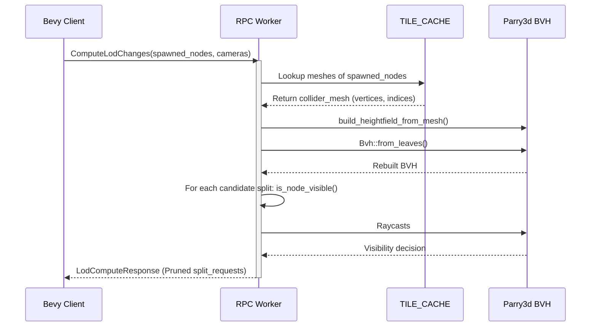

# Plan: Visibility-Aware LOD Tree Pruning (v2)

This document outlines the detailed implementation plan to add visibility-aware culling to TETROS crack.

## 1. Structs and Functions to Write

### game_logic/src/visibility.rs [NEW]

This module wraps `parry3d` and handles heightmap rasterization and occlusion queries.

#### Structures

1. `HEIGHTMAP_CACHE`
   - **Type**: `RwLock<Option<HashMap<MapTreeNodePath, HeightField>>>`
   - **Purpose**: Global caching of computed height maps.

2. `OccluderWorld`
   - **Members**:
     - `pub bvh: parry3d::partitioning::Bvh`
     - `pub heightfields: HashMap<u32, parry3d::shape::HeightField>`
     - `pub transforms: HashMap<u32, parry3d::math::Pose>`
     - `pub id_to_path: HashMap<u32, crate::map::MapTreeNodePath>`

#### Function Signatures

1. `pub fn invert_pose(pose: &parry3d::math::Pose) -> parry3d::math::Pose`
   - **Input**: Transformation pose of type `Pose`
   - **Output**: The inverted pose

2. `pub fn build_heightfield_from_mesh(bbox: &BBox, vertices: &[parry3d::math::Vector], indices: &[[u32; 3]]) -> parry3d::shape::HeightField`
   - **Input**: Axis-aligned bounding box and raw vertex/index data
   - **Output**: Simplified 64x64 heightfield

3. `impl OccluderWorld`
   - `pub async fn rebuild_bvh(spawned_nodes: &BTreeSet<MapTreeNodePath>, coarse_assets: &[MapTreeAssetInfo]) -> Self`
     - Constructs the BVH from active tiles
   - `pub fn is_ray_occluded(&self, origin: Vector, target: Vector, exclude_path: &MapTreeNodePath) -> bool`
     - Raycasts against the heightfields inside the BVH
   - `pub fn is_node_visible(&self, node_bbox: &BBox, node_path: &MapTreeNodePath, cameras: &[CameraReference]) -> bool`
     - Main entry point for visibility testing

---

### game_logic/src/lod.rs [MODIFY]

#### Structures

1. `CameraReference` [NEW]
   - **Members**:
     - `pub center: glam::Vec3`
     - `pub max_range: f32`

2. `LodComputeRequest` [MODIFY]
   - **Added Members**:
     - `pub cameras: Vec<CameraReference>`
     - `pub enable_visibility_cull: bool`

#### Function Signatures

1. `pub fn compute_lod_changes(data_res: &MapTreeData, req: &LodComputeRequest) -> LodComputeResponse`
   - Wire in `occluder_world` dynamic build and query to cull occluded splits.

---

### game_logic/src/worker/tile_impl.rs [MODIFY]

#### Function Signatures

1. `pub async fn get_tile_collider(tile_id: &str) -> Option<MeshColliderData>`
   - Thread-safe helper to lookup loaded collider meshes from `TILE_CACHE`.

---

### demo_resolution_selector_web_bevy/src/plugins/crack_plugin/lod_flow.rs [MODIFY]

#### Function Signatures

1. `pub fn spawn_lod_task(...)`
   - Calculate camera reach radius `r` and serialize `cameras` array into the RPC request.

## 2. Component Interactions & Rebuilding Flow

## 3. Verification Plan

- Run `cargo check --package game_logic --features worker` to ensure compiling works.
- Run `cargo check --package web_worker --target wasm32-unknown-unknown` to verify Service Worker compilation.
