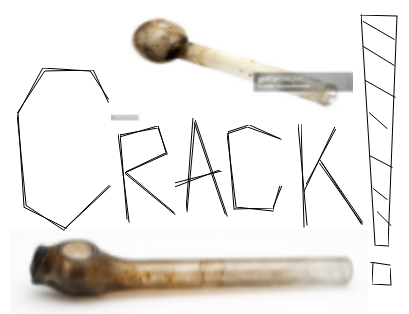
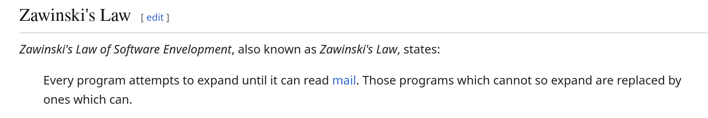
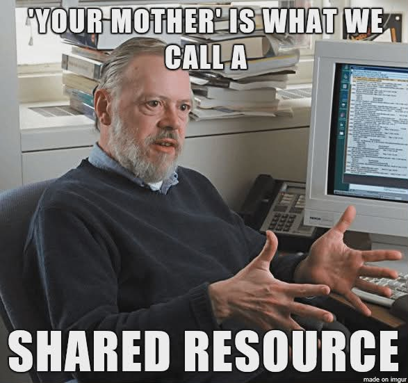
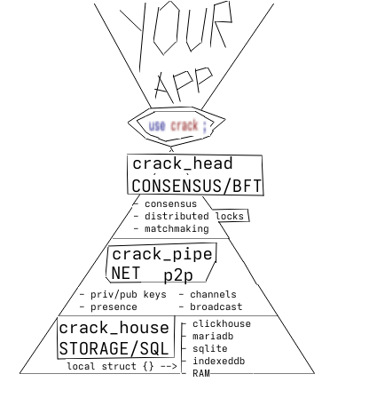

# Crack! -  storage, networking & consensus for decentralized p2p mmo

This library implements SQL storage, decentralized p2p networking and consensus, across native and browser platforms, to implement the basic layers for competitive p2p mmo netcode & business logic.

## [Zawinski's Law](https://en.wikipedia.org/wiki/Jamie_Zawinski#Zawinski's_Law)

## decentralized p2p mmo extension

We update the above definition for current times:

> Every program attempts to expand until it becomes a decentralized p2p mmo.

To aid in following such a noble pursuit, we present Crack! - a **shared resource** to provide the components required for decentralized p2p mmo development.

---

---

---

# Crack! - details

Crack users ("users", for short) use only one package configured in different ways to obtain access to the crack features including:

- api management
  - declare & implement business logic functions (async api provided)
- basic utils
  - connect to utils across platforms for:
    - async spawn() & utils
    - random number generation
    - date & time
- sql storage
  - based either on mysql/clickhouse (server) or sqlite (native/browser client)
  - orm for rows and signletons
  - async api
  - on browser use https://github.com/Spxg/sqlite-wasm-rs
- peer-to-peer (p2p) networking
  - based on https://docs.iroh.computer/quickstart
    - or maybe change providers ? https://github.com/freenet
  - identity management & global connection
  - connect to public / private chat rooms
  - broadcast / direct message
- consensus algo
  - distributed locks
  - matchmaking
  - discard hax